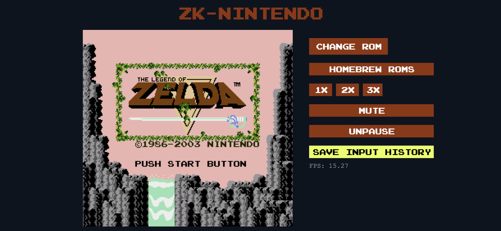

# ZK-Nintendo

## Overview

ZK-Nintendo combines NES emulation with zero knowledge proofs. By leveraging Succinct's SP1 ZK virtual machine, we are able to prove the execution of a modified, headless, NES emulator (see https://github.com/corddry/tetanes)

***Given a ROM file and a list of controller inputs, ZK-Nintendo is able to replay the inputs and prove the resulting video frame output of the console*** 

ZK-Nintendo is built off of lukexor's rust implementation of a NES emulator: Tetanes (see https://github.com/lukexor/tetanes)

## Some Provable Frames

&nbsp;&nbsp;
&nbsp;&nbsp;

## Features

- Proof generation and verification of NES state given a ROM and list of controller inputs
- Compilation of the emulator to Web Assembly, allowing ROMs to be played on a web browser
- Built in input recording for playback in a ZK circuit

## Project Structure

The project is divided into three main parts:

- `program/`: Contains the Rust program which is compiled to a RISCV executable
- `script/`: Contains Rust scripts used to generate and verify proofs
- `web/`: Contains the web interface for the emulator, written in Rust, compiled to WebAssembly, and used to record controller inputs for use in proof generation.

Each part has its own `Cargo.toml` file for managing Rust dependencies and a `src/` directory for source code.

## Getting Started

To get started with ZK-Nintendo, follow these steps:

0. Install Succinct SP1: https://succinctlabs.github.io/sp1/getting-started/install.html
1. Clone the repository: `git clone https://github.com/your-username/zk-nintendo.git`
2. `cd zk-nintendo`

### Using the Web Interface
Skip this step if you only want to prove the provided replays
1. `cd web`
2. Install the necessary dependencies: `npm install`
3. Build the project: `sh bin/build.sh`
4. Start the emulator: `sh bin/start.sh`
5. Open http://localhost:8080/ 
6. Use the web interface to load and play a ROM

NOTE: Tetanes is only compatible with iNES or NES2.0 formatted ROMs. If the emulator doesn't react when attempting to load a ROM, it is likely that the ROM is not iNES or NES2.0 formatted

7. Click "Save Input History" to download a replay file
8. Move this replay file to zk-nintendo/script/replays/

### Compiling the Program
1. `cd zk-nintendo/program`
2. `cargo prove build`

program/ also contains a proof of concept script for replaying a input history file on the headless NES, and saving the output PNG, but without using SP1. This can be executed by running `cargo run --bin poc --release` from the program directory

### Generating a Proof
1. `cd zk-nintendo/script`

Note: if only proving the included ROM and replay, skip to step 5

2. Move your replay downloaded from the web interface to zk-nintendo/script/replays
3. Move the .nes ROM file you played to zk-nintendo/script/roms
4. Edit the include_bytes! macro in script/src/main.rs to reflect your replay and ROM files
5. Generate the proof with logging: `RUST_LOG=info cargo run --release`
6. If successful, a screenshot of the NES frame after replaying all of your inputs will be saved to script/ProvenImage.png

## Known Issues
ZK-Nintendo's proving script requires a large amount of memory to execute. It is unlikely that the script will execute on your local machine.

